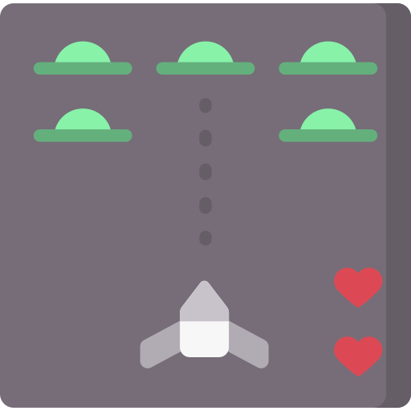
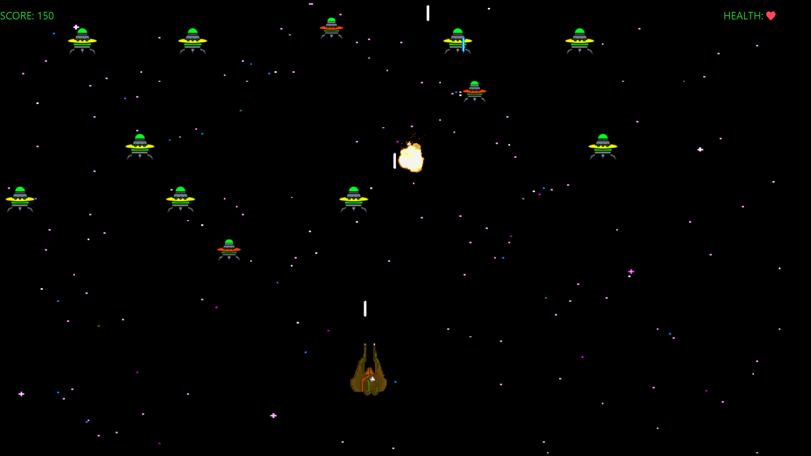
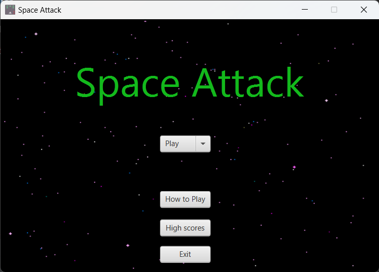
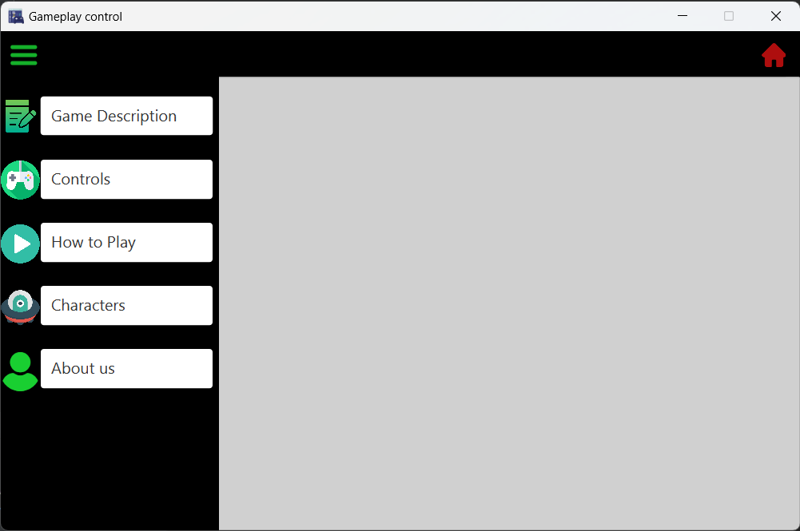
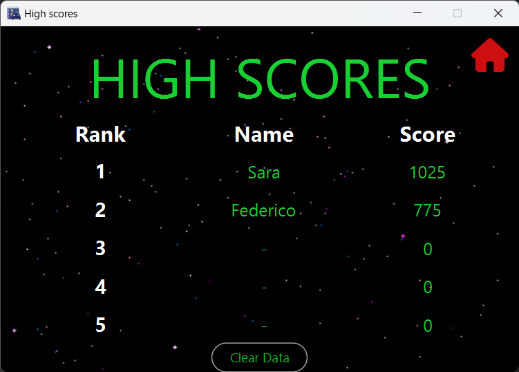

# SpaceAttack

Space Attack is a two-dimensional shooter game in which the player controls a spaceship and has to fight the approaching aliens,
your aim is to get the best score, defeat aliens and destroy asteroids to accomplish it.\
The aliens attempt to destroy the ship by firing at it, avoid asteroids and enemy lasers to survive longer.

## Screenshots

###### Menu view
The main menu you see when starting the application.\
It allows you to play the game choosing the difficulty, see a description of the game, look at the best scores or exit.

###### How to Play view
Here you can find details about the game.

###### High Scores view
This is a list of the best scores, try to get on the top of the leaderboard!

## Requirements
This software was created and works on **Java 17.0.2**.    
The proper JDK or JRE should be installed in your system to run this application.

## How to play the game
You can run this game on Intellij, here's how:
1. Go to this link https://github.com/sarag25/space-attack
2. Click the green button Code on the top right of the screen and copy the HTTPS link
3. On Intellij go to File -> New -> Project from Version Control...
4. Copy the previous link in the URL field and press Clone

## License
This software is licensed under MIT License